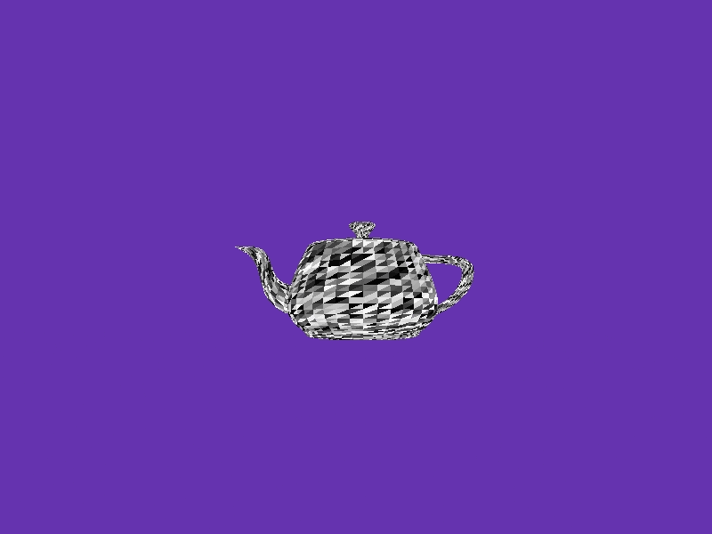

# SCOP: Basic GPU Rendering with OpenGL

SCOP is a small program designed to showcase basic GPU rendering with OpenGL.  
 The goal of the project is to create a simple application that displays a 3D object, rotates it around its main symmetrical axis, allows movement along three axes, and applies a texture to it.


## Project Overview

- Language: This is my first Rust project !
- Graphics API: OpenGL
- External Libraries: glfw for window management and event handling.
- No External Libraries: In this project, we weren't allowed to use any library for parsing obj files, vec3/matrix operations or shader loading.
- It's still a very basic project, so the textures are applied in a very simple way. Also, the triangulation algorithm for faces with more than 3 vertices is very simplistic and wouldn't work properly for more complex objects with concave faces. There is space for improvement !

## Getting Started
### Compilation:

```
git clone https://github.com/tgrasset/scop.git
cd scop
make
```

### Usage:
Run the binary file with the right arguments:    
 example: `./scop objects/teapot.obj objects/textures/lol.bmp`  

Use keyboard controls to interact with the 3D object:
   - Use left/right to rotate the object around Y axis.
   - Use up/down to rotate the object around X axis.
   - Use Z/X to rotate the object around Z axis.
   - Use W,A,S,D,Q,E to move the object in space.
   - Press the 'T' key to toggle texture application.